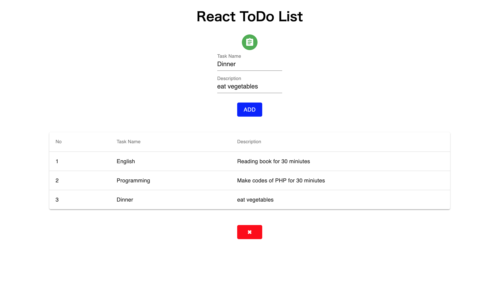

<<<<<<< HEAD
# React ToDo List

This is simple to-do list made by React.js.

Add task name and discription.
Delete tasks.

## development

### ・use create-react-app
```
$ npm install -g create-react-app
```

### ・make your app
```
$ create-react-app appname
```

### ・install material ui
```
$ cd appname
$ npm install @material-ui/core
$ npm install @material-ui/icons
```
### ・modify App.js

### ・run at local

$ npm start
<<<<<<< HEAD

open browser http://localhost:3000
=======
```



>>>>>>> 45c8b01021d17201bc6e79868d793ee9c6872c3d
